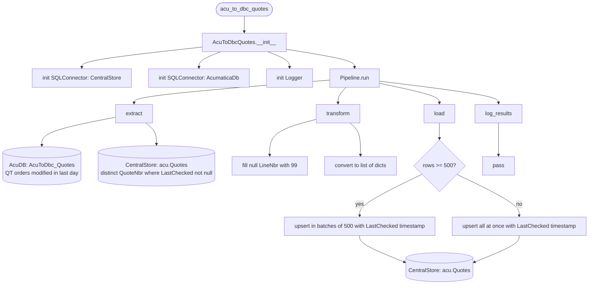

```mermaid
%%{init: {"flowchart": {"wrappingWidth": 400}}}%%
flowchart TD
    A([acu_to_dbc_quotes]) --> B[AcuToDbcQuotes.__init__]
    B --> B1[init SQLConnector: CentralStore]
    B --> B2[init SQLConnector: AcumaticaDb]
    B --> B3[init Logger]
    B --> RUN[Pipeline.run]

    RUN --> EX[extract]
    EX --> D1[(AcuDB: AcuToDbc_Quotes<br/>QT orders modified in last day)]
    EX --> D2[(CentralStore: acu.Quotes<br/>distinct QuoteNbr where LastChecked not null)]

    RUN --> TR[transform]
    TR --> T1[fill null LineNbr with 99]
    TR --> T2[convert to list of dicts]

    RUN --> LD[load]
    LD --> L1{rows >= 500?}
    L1 -->|yes| L2[upsert in batches of 500 with LastChecked timestamp]
    L1 -->|no| L3[upsert all at once with LastChecked timestamp]
    L2 --> CS1[(CentralStore: acu.Quotes)]
    L3 --> CS1

    RUN --> LR[log_results]
    LR --> LO[pass]
```
