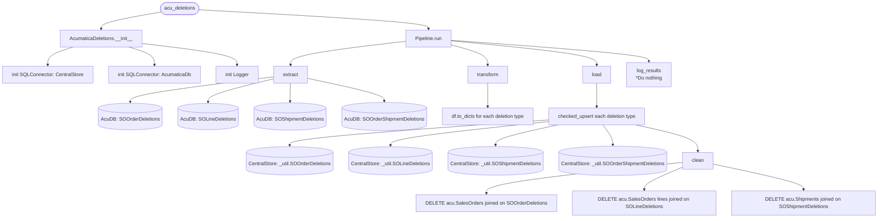

# acu_deletions
Pipeline to extract deleted records from **SOOrder**, **SOLine**, **SOOrderShipment** and **SOShipment** in *Acumatica* and load them to ***db_CentralStore***

## Schedule
- ### :40

## Execution Behavior
Executes single pipeline, **AcumaticaDeletions**

## Pipelines

### AcumaticaDeletions
#### `AcumaticaDeletions` Pipeline Documentation — [pipelines/acu_deletions.py](../../pipelines/acu_deletions.py)

## Queries
### AcumaticaDb
 - #### [SOOrderDeletions.sql](../../sql/queries/AcumaticaDb/SOOrderDeletions.sql)
 - #### [SOLineDeletions.sql](../../sql/queries/AcumaticaDb/SOLineDeletions.sql)
 - #### [SOShipmentDeletions.sql](../../sql/queries/AcumaticaDb/SOShipmentDeletions.sql)
 - #### [SOOrderShipmentDeletions.sql](../../sql/queries/AcumaticaDb/SOOrderShipmentDeletions.sql)