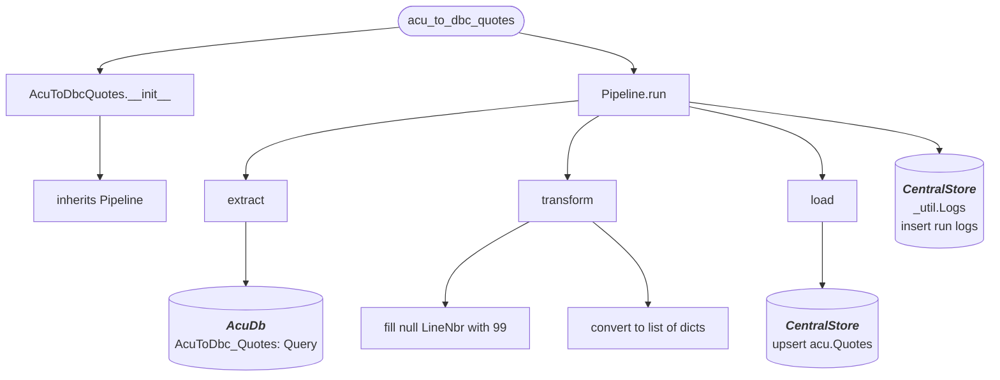

# acu_to_dbc_quotes
Gets all QT type Sales Orders from AcumaticaDb that were modified within the last day and loads them to **acu.Quotes**

## Schedule
- ### :00, :30

## Execution Behavior
Executes single pipeline, **AcuToDbcQuotes**

## Pipelines

### AcuToDbcQuotes
#### `AcuToDbcQuotes` Pipeline Documentation — [pipelines/acu_to_dbc_quotes.py](../../pipelines/acu_to_dbc_quotes.py)

## Queries
### AcumaticaDb
 - #### [AcuToDbc_Quotes.sql](../../sql/queries/AcumaticaDb/AcuToDbc_Quotes.sql)