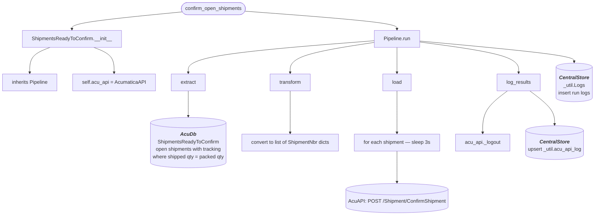

# confirm_acu_shipments
 *1. Pulls all Open RedStag Shipments that have a Tracking Number and are ready to be confirmed*

 *2. Formats payload for Shipment Confirmation via Acumatica API*

 *3. Sends payload to confirm each Shipment***

## Schedule
- ### :00, :20, :40

## Execution Behavior
Executes single pipeline, **ShipmentsReadyToConfirm**

## Pipelines

### ShipmentsReadyToConfirm
#### `ShipmentsReadyToConfirm` Pipeline Documentation — [pipelines/confirm_open_shipments.py](../../pipelines/confirm_open_shipments.py)

## Queries
### AcumaticaDb
 - #### [ShipmentsReadyToConfirm.sql](../../sql/queries/AcumaticaDb/ShipmentsReadyToConfirm.sql)