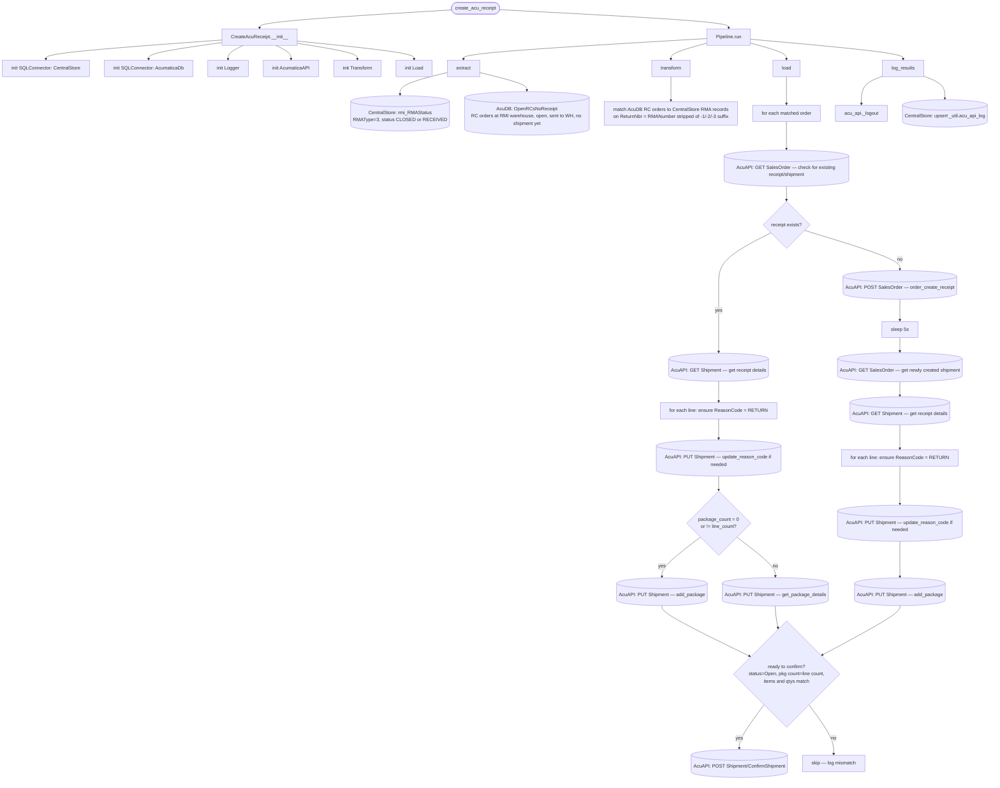

# create_acu_receipt
Queries CentralStore for any RMA orders with an RMAStatus of CLOSED and a DFStatus of RECEIVED
- These orders should be Receipted in Acumatica if it's not already done so

Queries Acudb for any RC Orders that are pending Receipt creation

Matches Orders across datasets to find any Acumatica Orders that are ready to be Receipted.

*For each* Matched Order:
* Check if it has a *Receipt*(Shipment) or not via *Acumatica API*
    * If Receipt, retrieve details via *Acu API*
    * If no Receipt, create one via *Acu API* then retrieve details
* For *each line* on the Shipment:
    * Verify the **Reason Code** is set to **RETURN**. If not, update via *Acu API*
* If there's no **Package** *or* the # of lines on the Package != Line Details, create Package
* Verify Shipment Details and Package Items and Quantities match
* If all checks are passed, Confirm Shipment

## Schedule
- ### :50

## Execution Behavior
Executes single pipeline, **CreateAcuReceipt**

## Pipelines

### CreateAcuReceipt
#### `CreateAcuReceipt` Pipeline Documentation — [pipelines/create_acu_receipt.py](../../pipelines/create_acu_receipt.py)

## Queries
### AcumaticaDb
 - #### [ReturnsPendingReciept.sql](../../sql/queries/AcumaticaDb/ReturnsPendingReciept.sql)
 - #### [OpenRCsNoReceipt.sql](../../sql/queries/AcumaticaDb/OpenRCsNoReceipt.sql)