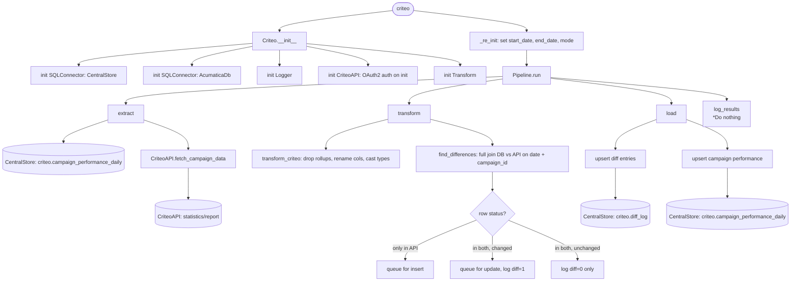

# criteo_ads
Initializes an instance of the Criteo Pipeline, then hits Criteo._re_init with the parameters for loading ads *incrementally*

1. Query **criteo.campaign_performance_daily** to get our current data

2. Hit CriteoAPI with fetch_campaign_data 
    
3. Parse response in transform_criteo

4. Compare differences between parsed response and db in find_differences

5. Upsert to **criteo.campaign_performance_daily** and **criteo.diff_log** via checked_upsert
    

## Schedule
- ### :01

## Execution Behavior
Executes single pipeline, **Criteo**

## Pipelines

### Criteo
#### `Criteo` Pipeline Documentation — [pipelines/criteo.py](../../pipelines/criteo.py)

## Queries
### db_CentralStore
 - #### `select * from criteo.campaign_performance_daily`