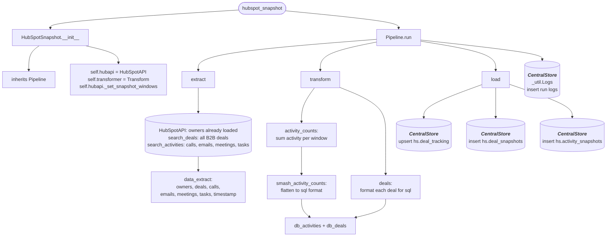

# hubspot_snapshots
Gets all QT type Sales Orders from AcumaticaDb that were modified within the last day and loads them to **acu.Quotes**

## Schedule
- ### 11:30pm

## Execution Behavior
Executes single pipeline, **HubSpotSnapshot**

## Pipelines

### HubSpotSnapshot
#### `HubSpotSnapshot` Pipeline Documentation — [pipelines/hubspot_snapshot.py](../../pipelines/hubspot_snapshot.py)

## Queries
None
