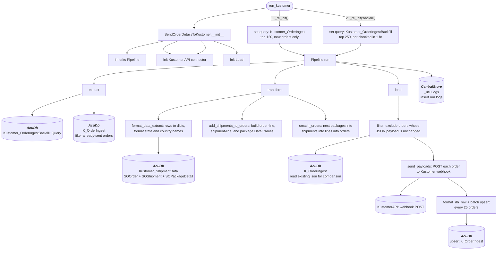

# kustomer_order_backfill
Gets top 250 orders from AcumaticaDb/orders that either haven't been sent to Kustomer or were modified in the last few hours

Pulls shipment details & tracking, formats, then sends to Kustomer

## Schedule
- ### :00, :12, :24, :36, :48

## Execution Behavior
Executes single pipeline, **SendOrderDetailsToKustomer**, with **'backfill'** passed to *_re_init*

## Pipelines

### SendOrderDetailsToKustomer
#### `SendOrderDetailsToKustomer` Pipeline Documentation — [pipelines/kustomer.py](../../pipelines/kustomer.py)

## Queries
### AcumaticaDb
 - #### [Kustomer_OrderIngestBackfill.sql](../../sql/queries/AcumaticaDb/Kustomer_OrderIngestBackfill.sql)