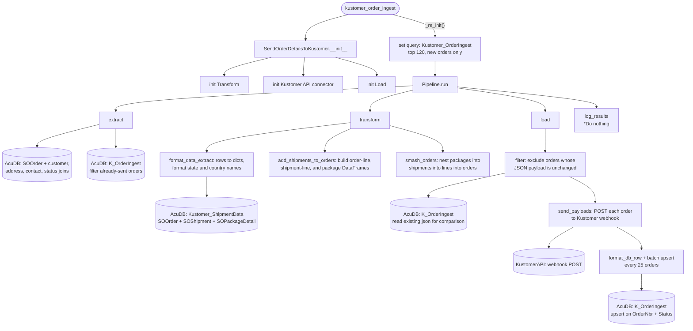

# kustomer_order_ingest
Gets all recent orders from AcumaticaDb/orders that haven't been sent to Kustomer

Pulls shipment details & tracking, formats, then sends to Kustomer

## Schedule
- ### :00, :12, :24, :36, :48

## Execution Behavior
Executes single pipeline, **SendOrderDetailsToKustomer** with **'ingest'** passed to *_re_init* 
- We don't need to pass any value to _re_init. 'ingest' = default value

## Pipelines

### SendOrderDetailsToKustomer
#### `SendOrderDetailsToKustomer` Pipeline Documentation — [pipelines/kustomer.py](../../pipelines/kustomer.py)

## Queries
### AcumaticaDb
 - #### [Kustomer_OrderIngest.sql](../../sql/queries/AcumaticaDb/Kustomer_OrderIngest.sql)
### db_CentralStore
 - #### [placeholder.sql](../../sql/queries/db_CentralStore/placeholder.sql)
