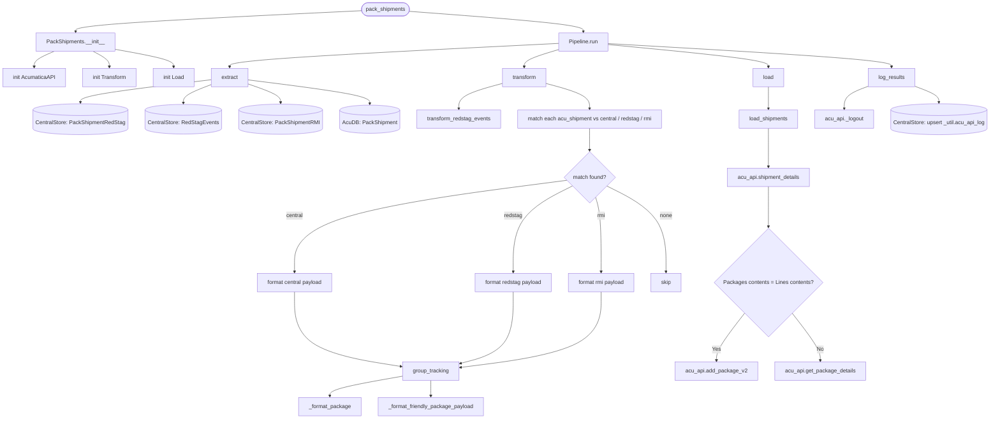

# pack_shipments
1. Queries CentralStore RedStag tables and json.RedStagEvents to find RedStag shipments ready to be packed and have tracking added.*

```python 
central_extract = self.centralstore.query_db(self.centralstore.queries.PackShipment.query)
```
```python 
redstag_event_extract = self.centralstore.query_db(self.centralstore.queries.RedStagEvents.query)
```
2. Queries AcumaticaDb for Open Shipments that have been sent to Warehouse but don't have a Tracking Nbr*
   
```python 
acu_extract = self.acudb.query_db(self.acudb.queries.PackShipment.query)
```
3. Matches results from Acumatica to one or both of the CentralStore extracts, then formats the Package payload to be sent to Acumatica's API*

4. Sends each Shipments Package Payload to Acumatica API*

## Schedule
- ### :0, :15, :30, :45

## Execution Behavior
Executes single pipeline, **PackShipments**

## Pipelines

### PackShipments
#### `PackShipments` Pipeline Documentation — [pipelines/pack_shipments.py](../../pipelines/pack_shipments.py)



## Queries
### AcumaticaDb
 - #### [PackShipment.sql](../../sql/queries/AcumaticaDb/PackShipment.sql)
### db_CentralStore
 - #### [PackShipmentRedStag.sql](../../sql/queries/db_CentralStore/PackShipmentRedStag.sql)
 - #### [RedStagEvents.sql](../../sql/queries/db_CentralStore/RedStagEvents.sql)
 - #### [PackShipmentRMI.sql](../../sql/queries/db_CentralStore/PackShipmentRMI.sql)