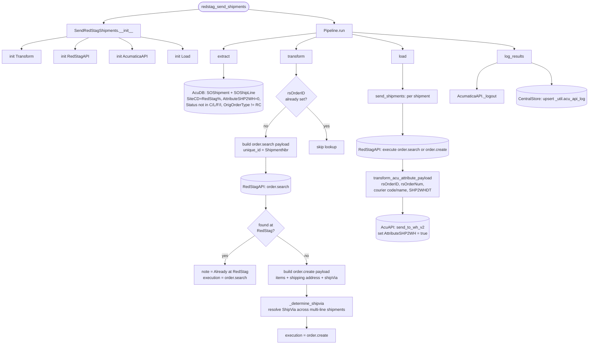

# redstag_send_shipment_pipeline
**summary**

## Schedule
- ### :05, :15, :35

## Execution Behavior
Executes single pipeline, **SendRedStagShipments**

---

## Pipelines

### SendRedStagShipments
#### `SendRedStagShipments` Pipeline Documentation — [pipelines/redstag_send_shipments.py](../../pipelines/redstag_send_shipments.py)

## Queries
### AcumaticaDb
 - #### [SendRedStagShipments.sql](../../sql/queries/AcumaticaDb/SendRedStagShipments.sql)