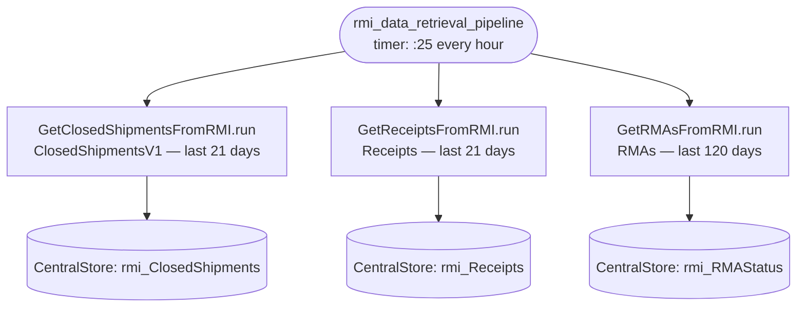
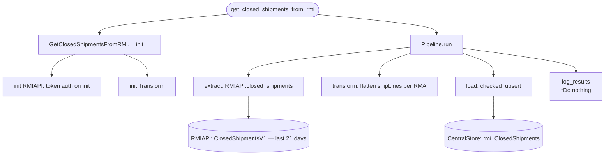
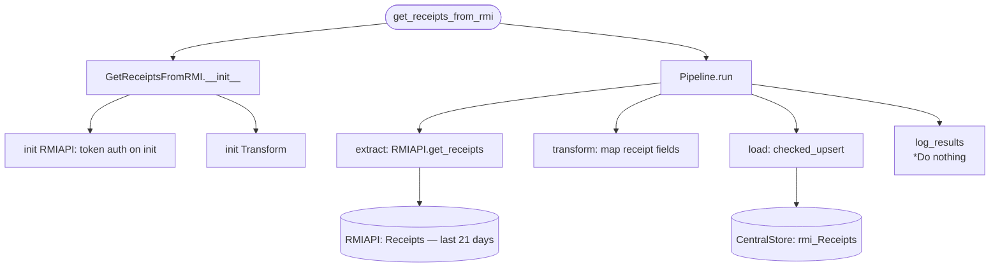
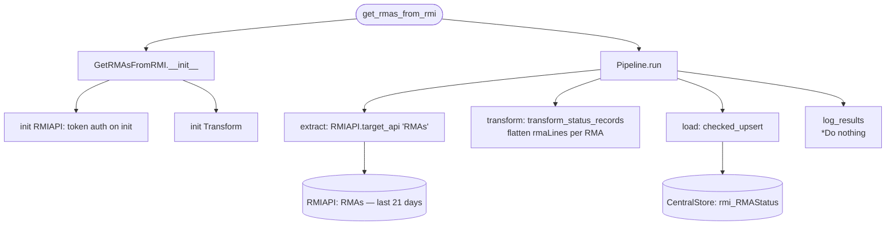

# rmi_data_retrieval_pipeline
**Hits RMI's *ClosedShipmentsV1* endpoint, transforms, then upserts to *rmi_ClosedShipments***

**Hits RMI's *Receipts* endpoint , transforms, then upserts to *rmi_Receipts***

**Hits RMI's *RMAs* endpoint , transforms, then upserts to *rmi_RMAStatus***

## Schedule
- ### :25

## Execution Behavior

## Pipelines

### GetClosedShipmentsFromRMI
#### `GetClosedShipmentsFromRMI` Pipeline Documentation — [pipelines/get_closed_shipments_from_RMI.py](../../pipelines/get_closed_shipments_from_RMI.py)

### GetReceiptsFromRMI
#### `GetReceiptsFromRMI` Pipeline Documentation — [pipelines/get_receipts_from_rmi.py](../../pipelines/get_receipts_from_rmi.py)

### GetRMAsFromRMI
#### `GetRMAsFromRMI` Pipeline Documentation — [pipelines/get_rmas_from_rmi.py](../../pipelines/get_rmas_from_rmi.py)

## Queries
None