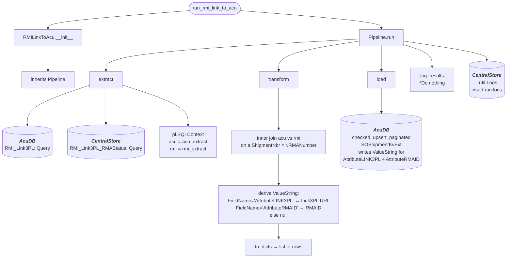

# rmi_link_to_acumatica
Gets all QT type Sales Orders from AcumaticaDb that were modified within the last day and loads them to **acu.Quotes**

## Schedule
- ### :00, :30

## Execution Behavior
Executes single pipeline, **RMILinkToAcu**

## Pipelines

### RMILinkToAcu
#### `RMILinkToAcu` Pipeline Documentation — [pipelines/rmi_link_to_acu.py](../../pipelines/rmi_link_to_acu.py)

## Queries
### AcumaticaDb
 - #### [RMI_Link3PL.sql](../../sql/queries/AcumaticaDb/RMI_Link3PL.sql)
### db_CentralStore
 - #### [RMI_Link3PL_RMAStatus.sql](../../sql/queries/db_CentralStore/RMI_Link3PL_RMAStatus.sql)