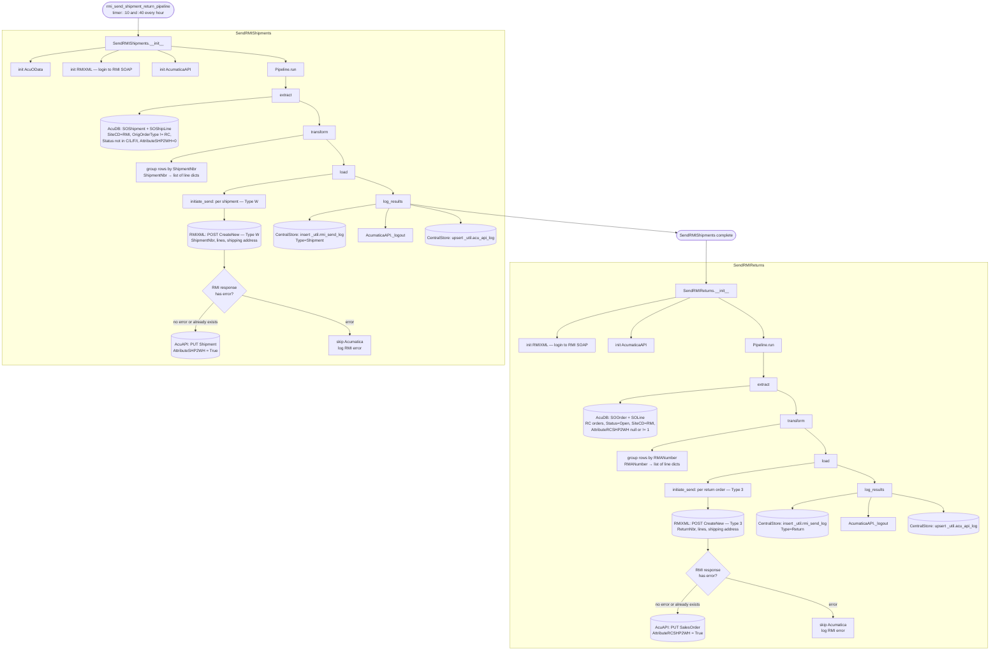

```mermaid
%%{init: {"flowchart": {"wrappingWidth": 400}}}%%
flowchart TD
    TRIGGER([rmi_send_shipment_return_pipeline<br/>timer: :10 and :40 every hour])
    TRIGGER --> A_INIT

    subgraph SRS ["  SendRMIShipments  "]
        A_INIT[SendRMIShipments.__init__]
        A_INIT --> A_B1[init AcuOData]
        A_INIT --> A_B2[init RMIXML — login to RMI SOAP]
        A_INIT --> A_B3[init AcumaticaAPI]
        A_INIT --> A_RUN[Pipeline.run]

        A_RUN --> A_EX[extract]
        A_EX --> A_D1[(AcuDB: SOShipment + SOShipLine<br/>SiteCD=RMI, OrigOrderType != RC,<br/>Status not in C/L/F/I, AttributeSHP2WH=0)]
        A_EX --> A_TR[transform]
        A_TR --> A_T1[group rows by ShipmentNbr<br/>ShipmentNbr → list of line dicts]
        A_TR --> A_LD[load]
        A_LD --> A_LD1[initiate_send: per shipment — Type W]
        A_LD1 --> A_RS1[(RMIXML: POST CreateNew — Type W<br/>ShipmentNbr, lines, shipping address)]
        A_RS1 --> A_LD2{RMI response<br/>has error?}
        A_LD2 -->|no error or already exists| A_ACU[(AcuAPI: PUT Shipment<br/>AttributeSHP2WH = True)]
        A_LD2 -->|error| A_SKIP[skip Acumatica<br/>log RMI error]
        A_LD --> A_LR[log_results]
        A_LR --> A_LR1[(CentralStore: insert _util.rmi_send_log<br/>Type=Shipment)]
        A_LR --> A_LO[AcumaticaAPI._logout]
        A_LR --> A_UPS[(CentralStore: upsert _util.acu_api_log)]
    end

    A_LR --> A_DONE([SendRMIShipments complete])
    A_DONE --> B_INIT

    subgraph SRR ["  SendRMIReturns  "]
        B_INIT[SendRMIReturns.__init__]
        B_INIT --> B_B1[init RMIXML — login to RMI SOAP]
        B_INIT --> B_B2[init AcumaticaAPI]
        B_INIT --> B_RUN[Pipeline.run]

        B_RUN --> B_EX[extract]
        B_EX --> B_D1[(AcuDB: SOOrder + SOLine<br/>RC orders, Status=Open, SiteCD=RMI,<br/>AttributeRCSHP2WH null or != 1)]
        B_EX --> B_TR[transform]
        B_TR --> B_T1[group rows by RMANumber<br/>RMANumber → list of line dicts]
        B_TR --> B_LD[load]
        B_LD --> B_LD1[initiate_send: per return order — Type 3]
        B_LD1 --> B_RS1[(RMIXML: POST CreateNew — Type 3<br/>ReturnNbr, lines, shipping address)]
        B_RS1 --> B_LD2{RMI response<br/>has error?}
        B_LD2 -->|no error or already exists| B_ACU[(AcuAPI: PUT SalesOrder<br/>AttributeRCSHP2WH = True)]
        B_LD2 -->|error| B_SKIP[skip Acumatica<br/>log RMI error]
        B_LD --> B_LR[log_results]
        B_LR --> B_LR1[(CentralStore: insert _util.rmi_send_log<br/>Type=Return)]
        B_LR --> B_LO[AcumaticaAPI._logout]
        B_LR --> B_UPS[(CentralStore: upsert _util.acu_api_log)]
    end
```
