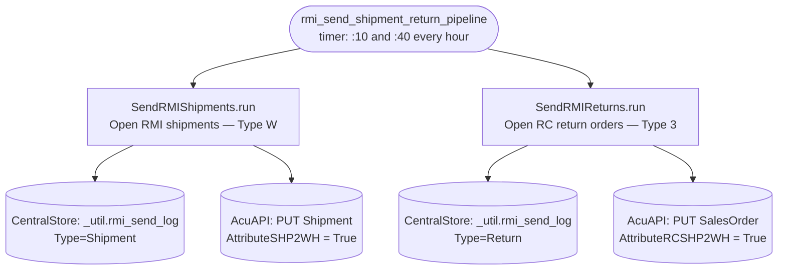

---

**Pipeline docs:**
- `SendRMIShipments` — see [pipelines/rmi_send_shipments.py](../../pipelines/rmi_send_shipments.py)
- `SendRMIReturns` — see [docs/pipelines/rmi_send_returns.md](../pipelines/rmi_send_returns.md)
