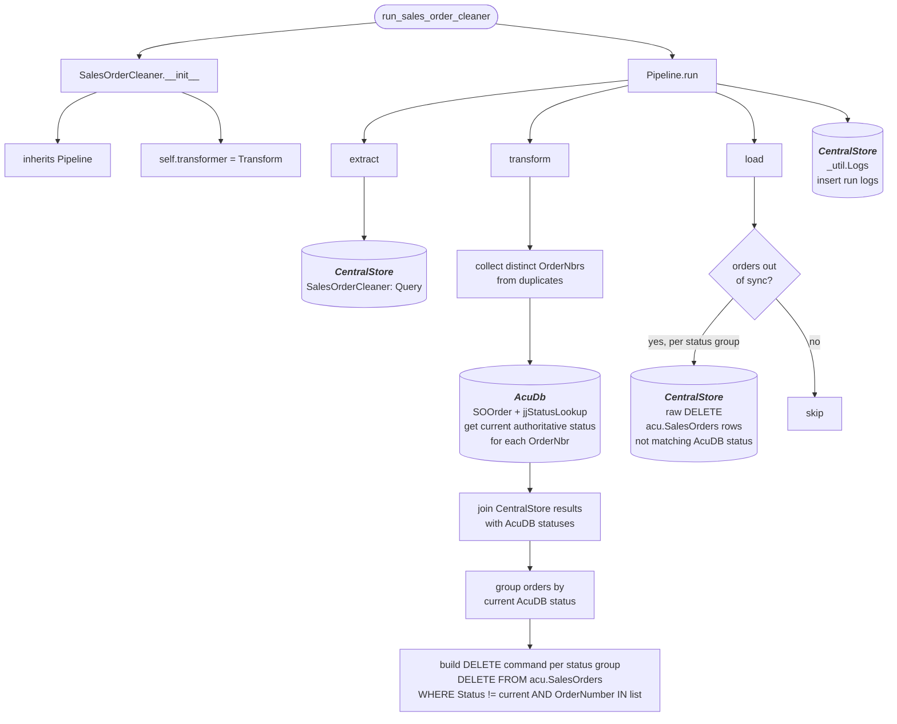

# sales_order_cleaner
Gets all QT type Sales Orders from AcumaticaDb that were modified within the last day and loads them to **acu.Quotes**

## Schedule
- ### :00, :30

## Execution Behavior
Executes single pipeline, **SalesOrderCleaner**

## Pipelines

### SalesOrderCleaner
#### `SalesOrderCleaner` Pipeline Documentation — [pipelines/sales_order_cleaner.py](../../pipelines/sales_order_cleaner.py)

## Queries
### db_CentralStore
 - #### [SalesOrderCleaner.sql](../../sql/queries/db_CentralStore/SalesOrderCleaner.sql)