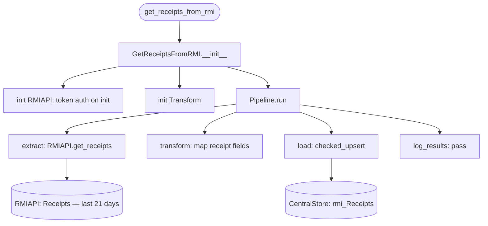

```mermaid
%%{init: {"flowchart": {"wrappingWidth": 400}}}%%
flowchart TD
    A([get_receipts_from_rmi]) --> B[GetReceiptsFromRMI.__init__]
    B --> B1[init RMIAPI: token auth on init]
    B --> B2[init Transform]
    B --> RUN[Pipeline.run]

    RUN --> EX[extract: RMIAPI.get_receipts]
    EX --> D1[(RMIAPI: Receipts — last 21 days)]

    RUN --> TR[transform: map receipt fields]

    RUN --> LD[load: checked_upsert]
    LD --> CS1[(CentralStore: rmi_Receipts)]

    RUN --> LR[log_results: pass]
```
