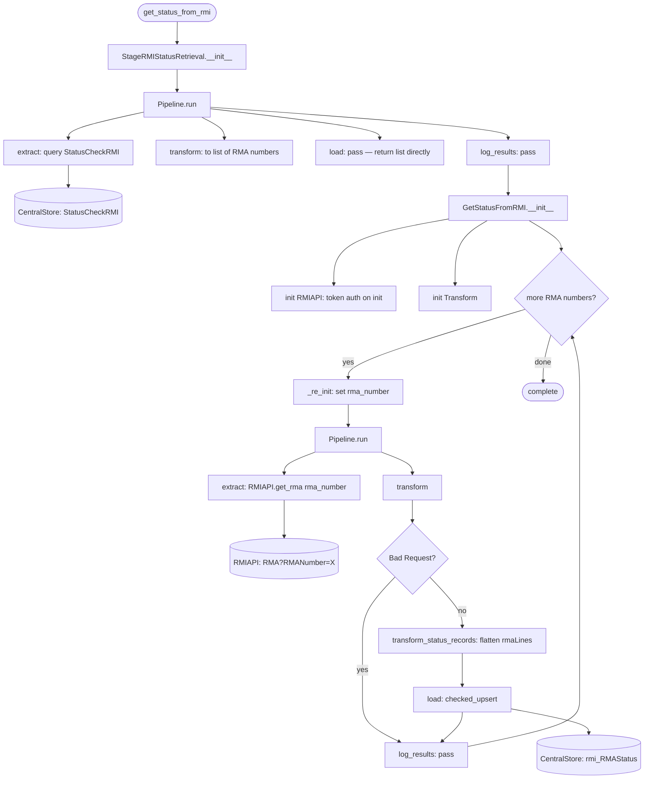

```mermaid
%%{init: {"flowchart": {"wrappingWidth": 400}}}%%
flowchart TD
    A([get_status_from_rmi]) --> ST[StageRMIStatusRetrieval.__init__]
    ST --> STRUN[Pipeline.run]
    STRUN --> STEX[extract: query StatusCheckRMI]
    STEX --> STDB[(CentralStore: StatusCheckRMI)]
    STRUN --> STTR[transform: to list of RMA numbers]
    STRUN --> STLD[load: pass — return list directly]
    STRUN --> STLR[log_results: pass]

    STLR --> GS[GetStatusFromRMI.__init__]
    GS --> GS1[init RMIAPI: token auth on init]
    GS --> GS2[init Transform]
    GS --> LOOP{more RMA numbers?}
    LOOP -->|yes| RI[_re_init: set rma_number]
    RI --> GSRUN[Pipeline.run]
    GSRUN --> GSEX[extract: RMIAPI.get_rma rma_number]
    GSEX --> GSAPI[(RMIAPI: RMA?RMANumber=X)]
    GSRUN --> GSTR[transform]
    GSTR --> BADREQ{Bad Request?}
    BADREQ -->|yes| GSLR[log_results: pass]
    BADREQ -->|no| GSTRD[transform_status_records: flatten rmaLines]
    GSTRD --> GSLD[load: checked_upsert]
    GSLD --> GSDB[(CentralStore: rmi_RMAStatus)]
    GSLD --> GSLR
    GSLR --> LOOP
    LOOP -->|done| FINISH([complete])
```
