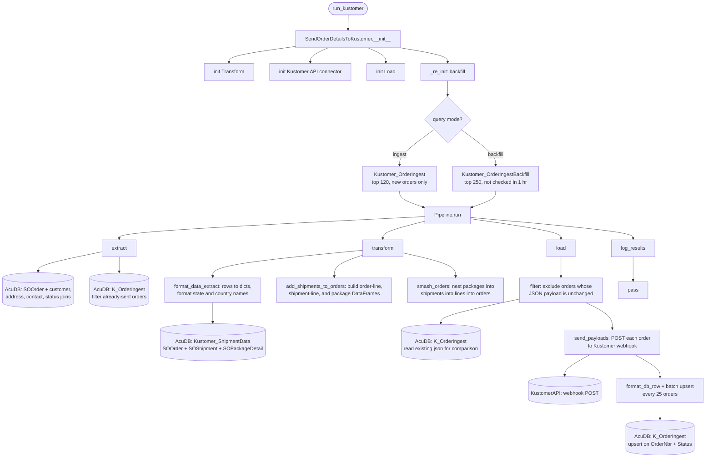

```mermaid
%%{init: {"flowchart": {"wrappingWidth": 400}}}%%
flowchart TD
    A([run_kustomer]) --> B[SendOrderDetailsToKustomer.__init__]
    B --> B1[init Transform]
    B --> B2[init Kustomer API connector]
    B --> B3[init Load]
    B --> RI[_re_init: backfill]
    RI --> QSET{query mode?}
    QSET -->|ingest| Q1[Kustomer_OrderIngest<br/>top 120, new orders only]
    QSET -->|backfill| Q2[Kustomer_OrderIngestBackfill<br/>top 250, not checked in 1 hr]
    Q1 --> RUN[Pipeline.run]
    Q2 --> RUN

    RUN --> EX[extract]
    EX --> D1[(AcuDB: SOOrder + customer,<br/>address, contact, status joins)]
    EX --> D2[(AcuDB: K_OrderIngest<br/>filter already-sent orders)]

    RUN --> TR[transform]
    TR --> T1[format_data_extract: rows to dicts,<br/>format state and country names]
    T1 --> D3[(AcuDB: Kustomer_ShipmentData<br/>SOOrder + SOShipment + SOPackageDetail)]
    TR --> T2[add_shipments_to_orders: build order-line,<br/>shipment-line, and package DataFrames]
    TR --> T3[smash_orders: nest packages into<br/>shipments into lines into orders]

    RUN --> LD[load]
    LD --> LS1[filter: exclude orders whose<br/>JSON payload is unchanged]
    LS1 --> D4[(AcuDB: K_OrderIngest<br/>read existing json for comparison)]
    LS1 --> LS2[send_payloads: POST each order<br/>to Kustomer webhook]
    LS2 --> D5[(KustomerAPI: webhook POST)]
    LS2 --> LS3[format_db_row + batch upsert<br/>every 25 orders]
    LS3 --> D6[(AcuDB: K_OrderIngest<br/>upsert on OrderNbr + Status)]

    RUN --> LR[log_results]
    LR --> LO[pass]
```