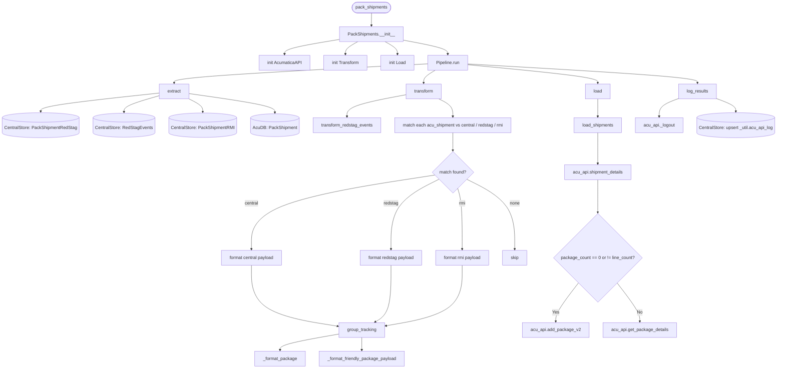

```mermaid
%%{init: {"flowchart": {"wrappingWidth": 400}}}%%
flowchart TD
    A([pack_shipments]) --> B[PackShipments.__init__]
    B --> B1[init AcumaticaAPI]
    B --> B2[init Transform]
    B --> B3[init Load]
    B --> RUN[Pipeline.run]

    RUN --> EX[extract]
    EX --> D1[(CentralStore: PackShipmentRedStag)]
    EX --> D2[(CentralStore: RedStagEvents)]
    EX --> D3[(CentralStore: PackShipmentRMI)]
    EX --> D4[(AcuDB: PackShipment)]

    RUN --> TR[transform]
    TR --> T1[transform_redstag_events]
    TR --> T2[match each acu_shipment vs central / redstag / rmi]
    T2 --> MATCH{match found?}
    MATCH -->|central| M1[format central payload]
    MATCH -->|redstag| M2[format redstag payload]
    MATCH -->|rmi| M3[format rmi payload]
    MATCH -->|none| SKIP[skip]
    M1 & M2 & M3 --> GT[group_tracking]
    GT --> FP[_format_package]
    GT --> FFP[_format_friendly_package_payload]

    RUN --> LD[load]
    LD --> LS[load_shipments]
    LS --> SD[acu_api.shipment_details]
    SD --> PKG{package_count == 0 or != line_count?}
    PKG -->|Yes| AP[acu_api.add_package_v2]
    PKG -->|No| GP[acu_api.get_package_details]

    RUN --> LR[log_results]
    LR --> LO[acu_api._logout]
    LR --> UPS[(CentralStore: upsert _util.acu_api_log)]
```
