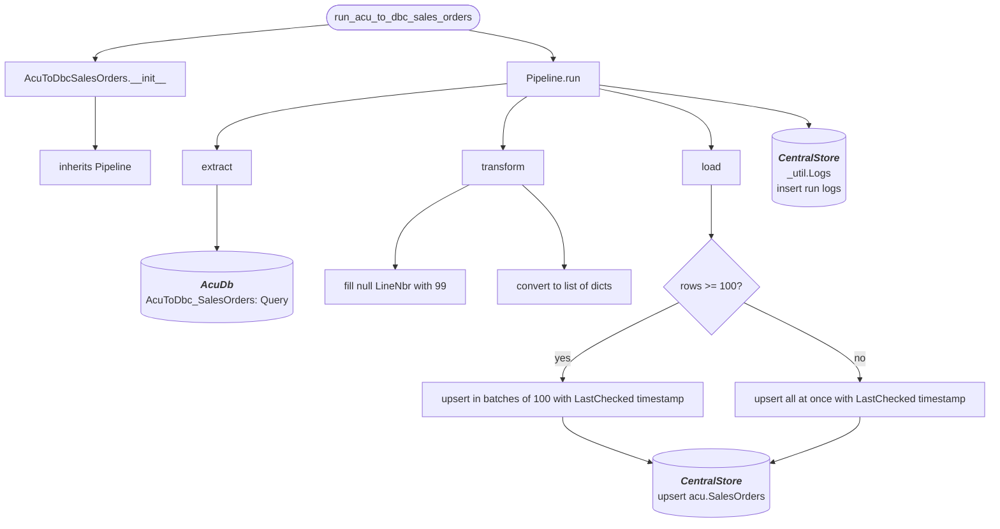

```mermaid
%%{init: {"flowchart": {"wrappingWidth": 400}}}%%
flowchart TD
    A([run_acu_to_dbc_sales_orders]) --> B[AcuToDbcSalesOrders.__init__]
    B --> B1[inherits Pipeline]
    A --> RUN[Pipeline.run]

    RUN --> EX[extract]
    EX --> D1[(
        <b><i>AcuDb</i></b>
        AcuToDbc_SalesOrders: Query
    )]

    RUN --> TR[transform]
    TR --> T1[fill null LineNbr with 99]
    TR --> T2[convert to list of dicts]

    RUN --> LD[load]
    LD --> L1{rows >= 100?}
    L1 -->|yes| L2[upsert in batches of 100 with LastChecked timestamp]
    L1 -->|no| L3[upsert all at once with LastChecked timestamp]
    L2 --> CS1[(
        <b><i>CentralStore</i></b>
        upsert acu.SalesOrders
    )]
    L3 --> CS1

    RUN --> LOGS[(
        <b><i>CentralStore</i></b>
        _util.Logs<br/>insert run logs
    )]
```
