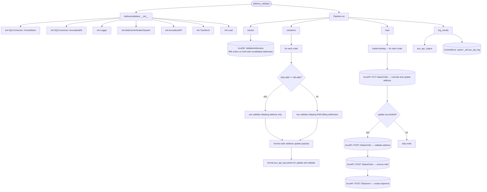

```mermaid
%%{init: {"flowchart": {"wrappingWidth": 400}}}%%
flowchart TD
    A([address_validator]) --> B[AddressValidator.__init__]
    B --> B1[init SQLConnector: CentralStore]
    B --> B2[init SQLConnector: AcumaticaDb]
    B --> B3[init Logger]
    B --> B4[init AddressVerificationSystem]
    B --> B5[init AcumaticaAPI]
    B --> B6[init Transform]
    B --> B7[init Load]
    A --> RUN[Pipeline.run]

    RUN --> EX[extract]
    EX --> D1[(AcuDB: ValidateAddresses<br/>WB orders on hold with unvalidated addresses)]

    RUN --> TR[transform]
    TR --> T1[for each order]
    T1 --> T2{ship addr == bill addr?}
    T2 -->|yes| T3[avs.validate shipping address only]
    T2 -->|no| T4[avs.validate shipping AND billing addresses]
    T3 --> T5[format order address update payload]
    T4 --> T5
    T5 --> T6[format acu_api_log entries for update and validate]

    RUN --> LD[load]
    LD --> LS[loader.landing — for each order]
    LS --> L1[(AcuAPI: PUT /SalesOrder — override and update address)]
    L1 --> L2{update succeeded?}
    L2 -->|yes| L3[(AcuAPI: POST /SalesOrder — validate address)]
    L3 --> L4[(AcuAPI: POST /SalesOrder — remove hold)]
    L4 --> L5[(AcuAPI: POST /Shipment — create shipment)]
    L2 -->|no| L6[skip order]

    RUN --> LR[log_results]
    LR --> LO[acu_api._logout]
    LR --> UPS[(CentralStore: upsert _util.acu_api_log)]
```
