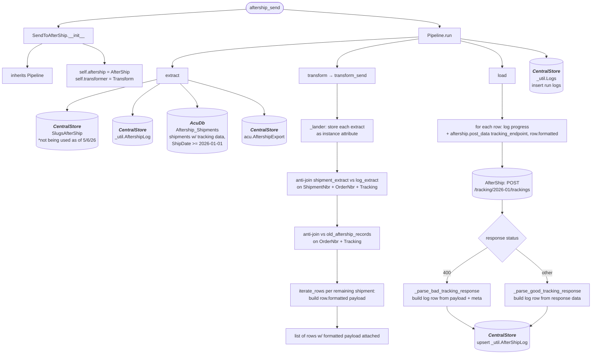

```mermaid
%%{init: {"flowchart": {"wrappingWidth": 400}}}%%
flowchart TD
    A([aftership_send]) --> B[SendToAfterShip.__init__]
    B --> B1[inherits Pipeline]
    B --> B2[
        self.aftership = AfterShip
        self.transformer = Transform
    ]
    A --> RUN[Pipeline.run]

    RUN --> EX[extract]
    EX --> D1[(
        <b><i>CentralStore</i></b>
        SlugsAfterShip
        *not being used as of 5/6/26
    )]
    EX --> D2[(
        <b><i>CentralStore</i></b>
        _util.AftershipLog
    )]
    EX --> D3[(
        <b><i>AcuDb</i></b>
        Aftership_Shipments<br/>shipments w/ tracking data,<br/>ShipDate >= 2026-01-01)]
    EX --> D4[(
        <b><i>CentralStore</i></b>
        acu.AftershipExport
    )]

    RUN --> TR[transform → transform_send]
    TR --> T1[_lander: store each extract<br/>as instance attribute]
    T1 --> T2[anti-join shipment_extract vs log_extract<br/>on ShipmentNbr + OrderNbr + Tracking]
    T2 --> T3[anti-join vs old_aftership_records<br/>on OrderNbr + Tracking]
    T3 --> T4[iterate_rows per remaining shipment:<br/>build row.formatted payload]
    T4 --> TR_OUT[list of rows w/ formatted payload attached]

    RUN --> LD[load]
    LD --> LP[for each row: log progress<br/>+ aftership.post_data tracking_endpoint, row.formatted]
    LP --> AS[(AfterShip: POST<br/>/tracking/2026-01/trackings)]
    AS --> RESP{response status}
    RESP -->|400| BAD[_parse_bad_tracking_response<br/>build log row from payload + meta]
    RESP -->|other| GOOD[_parse_good_tracking_response<br/>build log row from response data]
    BAD --> CSL[(
        <b><i>CentralStore</i></b>
        upsert _util.AfterShipLog
    )]
    GOOD --> CSL

    RUN --> LOGS[(
        <b><i>CentralStore</i></b>
        _util.Logs<br/>insert run logs
    )]
```
