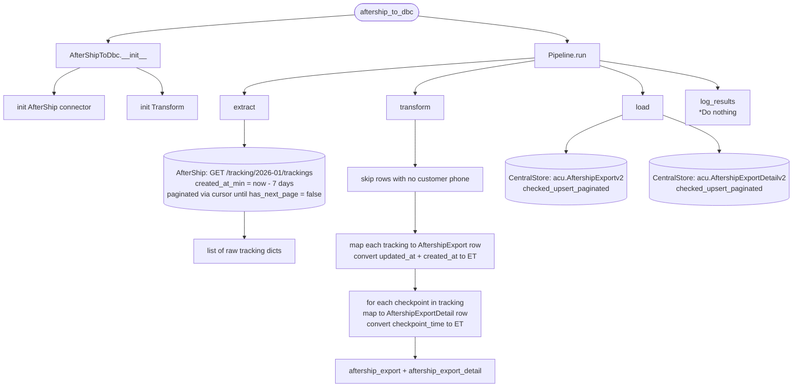

```mermaid
%%{init: {"flowchart": {"wrappingWidth": 400}}}%%
flowchart TD
    A([aftership_to_dbc]) --> B[AfterShipToDbc.__init__]
    B --> B1[init AfterShip connector]
    B --> B2[init Transform]
    A --> RUN[Pipeline.run]

    RUN --> EX[extract]
    EX --> AS[(AfterShip: GET /tracking/2026-01/trackings
    created_at_min = now - 7 days
    paginated via cursor until has_next_page = false)]
    AS --> EX_OUT[list of raw tracking dicts]

    RUN --> TR[transform]
    TR --> T1[skip rows with no customer phone]
    T1 --> T2[map each tracking to AftershipExport row<br/>convert updated_at + created_at to ET]
    T2 --> T3[for each checkpoint in tracking<br/>map to AftershipExportDetail row<br/>convert checkpoint_time to ET]
    T3 --> TR_OUT[aftership_export + aftership_export_detail]

    RUN --> LD[load]
    LD --> CS1[(CentralStore: acu.AftershipExportv2<br/>checked_upsert_paginated)]
    LD --> CS2[(CentralStore: acu.AftershipExportDetailv2<br/>checked_upsert_paginated)]

    RUN --> LR[log_results<br/>*Do nothing]
```
