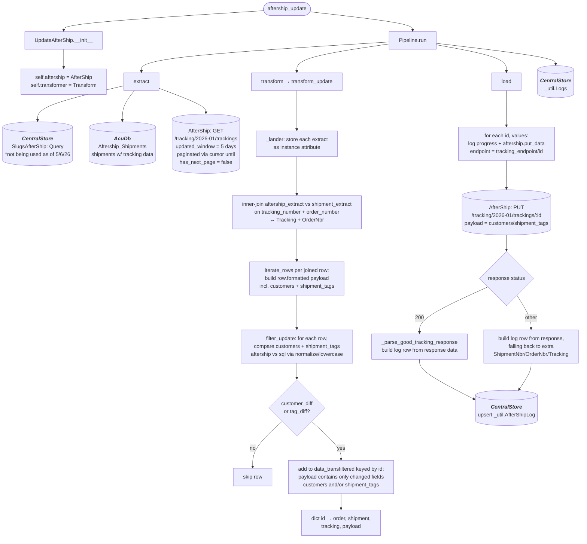

```mermaid
%%{init: {"flowchart": {"wrappingWidth": 400}}}%%
flowchart TD
    A([aftership_update]) --> B[UpdateAfterShip.__init__]
    B --> B1[
        self.aftership = AfterShip
        self.transformer = Transform
    ]
    A --> RUN[Pipeline.run]

    RUN --> EX[extract]
    EX --> D1[(
        <b><i>CentralStore</i></b>
        SlugsAfterShip: Query
        *not being used as of 5/6/26
    )]
    EX --> D2[(
        <b><i>AcuDb</i></b>
        Aftership_Shipments<br/>shipments w/ tracking data)]
    EX --> AS1[(AfterShip: GET<br/>/tracking/2026-01/trackings<br/>updated_window = 5 days<br/>paginated via cursor until<br/>has_next_page = false)]

    RUN --> TR[transform → transform_update]
    TR --> T1[_lander: store each extract<br/>as instance attribute]
    T1 --> T2[inner-join aftership_extract vs shipment_extract<br/>on tracking_number + order_number<br/>↔ Tracking + OrderNbr]
    T2 --> T3[iterate_rows per joined row:<br/>build row.formatted payload<br/>incl. customers + shipment_tags]
    T3 --> T4[filter_update: for each row,<br/>compare customers + shipment_tags<br/>aftership vs sql via normalize/lowercase]
    T4 --> T5{customer_diff<br/>or tag_diff?}
    T5 -->|no| SKIP[skip row]
    T5 -->|yes| BUILD[add to data_transfiltered keyed by id:<br/>payload contains only changed fields<br/>customers and/or shipment_tags]
    BUILD --> TR_OUT[dict id → order, shipment,<br/>tracking, payload]

    RUN --> LD[load]
    LD --> LP[for each id, values:<br/>log progress + aftership.put_data<br/>endpoint = tracking_endpoint/id]
    LP --> ASP[(AfterShip: PUT<br/>/tracking/2026-01/trackings/:id<br/>payload = customers/shipment_tags)]
    ASP --> RESP{response status}
    RESP -->|200| GOOD[_parse_good_tracking_response<br/>build log row from response data]
    RESP -->|other| BAD[build log row from response,<br/>falling back to extra<br/>ShipmentNbr/OrderNbr/Tracking]
    GOOD --> CSL[(
        <b><i>CentralStore</i></b>
        upsert _util.AfterShipLog
    )]
    BAD --> CSL

    RUN --> LOGS[(
        <b><i>CentralStore</i></b>
        _util.Logs
    )]
```
