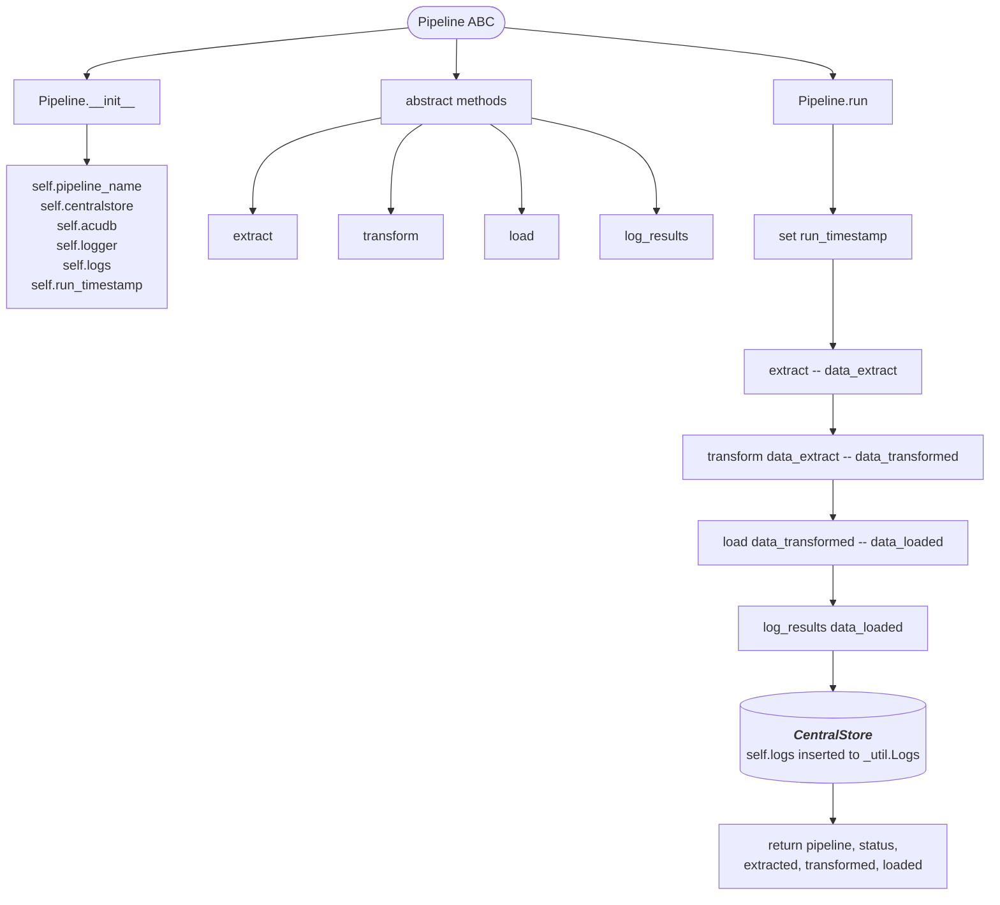

```mermaid
%%{init: {"flowchart": {"wrappingWidth": 400}}}%%
flowchart TD
    A([Pipeline ABC]) --> B[Pipeline.__init__]
    B --> B1[
        self.pipeline_name
        self.centralstore
        self.acudb
        self.logger
        self.logs
        self.run_timestamp
    ]

    A --> ABS[abstract methods]
    ABS --> ABS1[extract]
    ABS --> ABS2[transform]
    ABS --> ABS3[load]
    ABS --> ABS4[log_results]

    A --> RUN[Pipeline.run]
    RUN --> R0[set run_timestamp]
    R0 --> R1[extract -- data_extract]
    R1 --> R2[transform data_extract -- data_transformed]
    R2 --> R3[load data_transformed -- data_loaded]
    R3 --> R4[log_results data_loaded]
    R4 --> R5[(
        <b><i>CentralStore</i></b>
        self.logs inserted to _util.Logs
    )]
    R5 --> R6[return pipeline, status,<br/>extracted, transformed, loaded]
```
