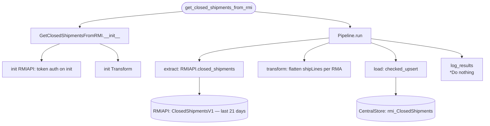

```mermaid
%%{init: {"flowchart": {"wrappingWidth": 400}}}%%
flowchart TD
    A([get_closed_shipments_from_rmi]) --> B[GetClosedShipmentsFromRMI.__init__]
    B --> B1[init RMIAPI: token auth on init]
    B --> B2[init Transform]
    A --> RUN[Pipeline.run]

    RUN --> EX[extract: RMIAPI.closed_shipments]
    EX --> D1[(RMIAPI: ClosedShipmentsV1 — last 21 days)]

    RUN --> TR[transform: flatten shipLines per RMA]

    RUN --> LD[load: checked_upsert]
    LD --> CS1[(CentralStore: rmi_ClosedShipments)]

    RUN --> LR[log_results<br/>*Do nothing]
```
