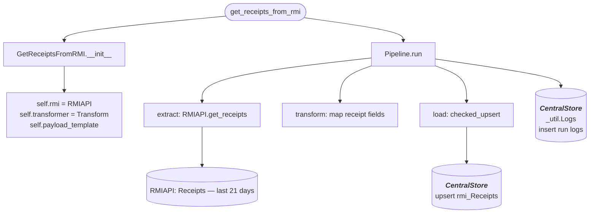

```mermaid
%%{init: {"flowchart": {"wrappingWidth": 400}}}%%
flowchart TD
    A([get_receipts_from_rmi]) --> B[GetReceiptsFromRMI.__init__]
    B --> B1[
        self.rmi = RMIAPI
        self.transformer = Transform
        self.payload_template
    ]
    A --> RUN[Pipeline.run]

    RUN --> EX[extract: RMIAPI.get_receipts]
    EX --> D1[(RMIAPI: Receipts — last 21 days)]

    RUN --> TR[transform: map receipt fields]

    RUN --> LD[load: checked_upsert]
    LD --> CS1[(
        <b><i>CentralStore</i></b>
        upsert rmi_Receipts
    )]

    RUN --> LOGS[(
        <b><i>CentralStore</i></b>
        _util.Logs<br/>insert run logs
    )]
```
