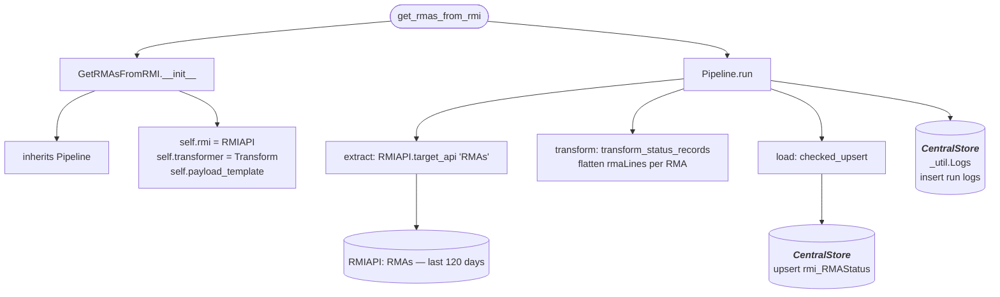

```mermaid
%%{init: {"flowchart": {"wrappingWidth": 400}}}%%
flowchart TD
    A([get_rmas_from_rmi]) --> B[GetRMAsFromRMI.__init__]
    B --> B1[inherits Pipeline]
    B --> B2[
        self.rmi = RMIAPI
        self.transformer = Transform
        self.payload_template
    ]
    A --> RUN[Pipeline.run]

    RUN --> EX[extract: RMIAPI.target_api 'RMAs']
    EX --> D1[(RMIAPI: RMAs — last 120 days)]

    RUN --> TR[transform: transform_status_records<br/>flatten rmaLines per RMA]

    RUN --> LD[load: checked_upsert]
    LD --> CS1[(
        <b><i>CentralStore</i></b>
        upsert rmi_RMAStatus
    )]

    RUN --> LOGS[(
        <b><i>CentralStore</i></b>
        _util.Logs<br/>insert run logs
    )]
```
