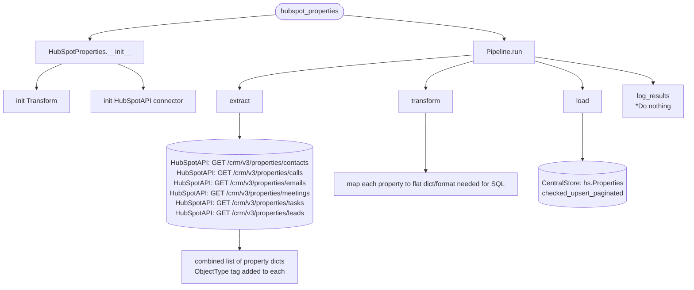

```mermaid
%%{init: {"flowchart": {"wrappingWidth": 400}}}%%
flowchart TD
    A([hubspot_properties]) --> B[HubSpotProperties.__init__]
    B --> B1[init Transform]
    B --> B2[init HubSpotAPI connector]
    A --> RUN[Pipeline.run]

    RUN --> EX[extract]
    
    EX --> HS[(HubSpotAPI: GET /crm/v3/properties/contacts
    HubSpotAPI: GET /crm/v3/properties/calls
    HubSpotAPI: GET /crm/v3/properties/emails
    HubSpotAPI: GET /crm/v3/properties/meetings
    HubSpotAPI: GET /crm/v3/properties/tasks
    HubSpotAPI: GET /crm/v3/properties/leads
    )]
    HS --> EX_OUT[combined list of property dicts<br/>ObjectType tag added to each]

    RUN --> TR[transform]
    TR --> T1[map each property to flat dict/format needed for SQL]

    RUN --> LD[load]
    LD --> CS1[(CentralStore: hs.Properties<br/>checked_upsert_paginated)]

    RUN --> LR[log_results<br/>*Do nothing]
```
