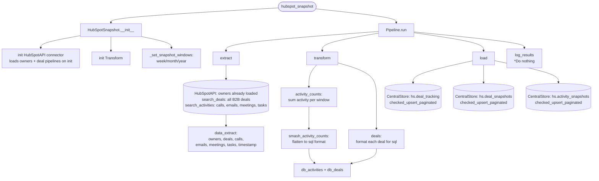

```mermaid
%%{init: {"flowchart": {"wrappingWidth": 400}}}%%
flowchart TD
    A([hubspot_snapshot]) --> B[HubSpotSnapshot.__init__]
    B --> B1[init HubSpotAPI connector<br/>loads owners + deal pipelines on init]
    B --> B2[init Transform]
    B --> B3[_set_snapshot_windows:
     week/month/year]
    A --> RUN[Pipeline.run]

    RUN --> EX[extract]
    EX --> HS[(HubSpotAPI: owners already loaded
    search_deals: all B2B deals
    search_activities: calls, emails, meetings, tasks)]
    HS --> EX_OUT[data_extract:
    owners, deals, calls,<br/>emails, meetings, tasks, timestamp]

    RUN --> TR[transform]
    TR --> T1[activity_counts: 
    sum activity per window ]
    T1 --> T2[smash_activity_counts: 
    flatten to sql format]
    TR --> T3[deals: 
    format each deal for sql]
    T2 & T3 --> TR_OUT[db_activities + db_deals]

    RUN --> LD[load]
    LD --> CS1[(CentralStore: hs.deal_tracking<br/>checked_upsert_paginated)]
    LD --> CS2[(CentralStore: hs.deal_snapshots<br/>checked_upsert_paginated)]
    LD --> CS3[(CentralStore: hs.activity_snapshots<br/>checked_upsert_paginated)]

    RUN --> LR[log_results<br/>*Do nothing]
```
