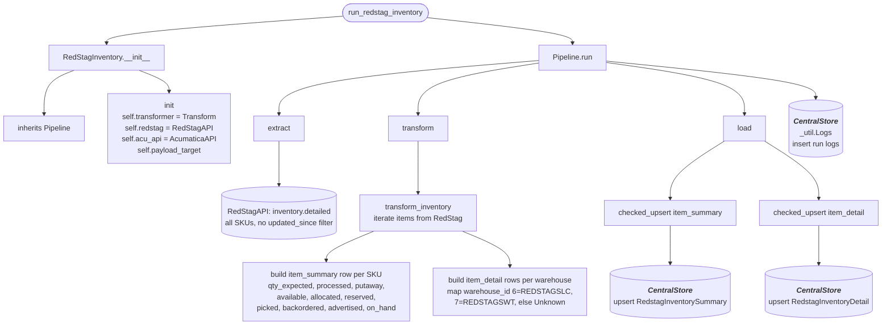

```mermaid
%%{init: {"flowchart": {"wrappingWidth": 400}}}%%
flowchart TD
    A([run_redstag_inventory]) --> B[RedStagInventory.__init__]
    B --> B1[inherits Pipeline]
    B --> B2[init
        self.transformer = Transform
        self.redstag = RedStagAPI
        self.acu_api = AcumaticaAPI
        self.payload_target
    ]
    A --> RUN[Pipeline.run]

    RUN --> EX[extract]
    EX --> RS1[(RedStagAPI: inventory.detailed<br/>all SKUs, no updated_since filter)]

    RUN --> TR[transform]
    TR --> TR1[transform_inventory<br/>iterate items from RedStag]
    TR1 --> TR2[build item_summary row per SKU<br/>qty_expected, processed, putaway,<br/>available, allocated, reserved,<br/>picked, backordered, advertised, on_hand]
    TR1 --> TR3[build item_detail rows per warehouse<br/>map warehouse_id 6=REDSTAGSLC,<br/>7=REDSTAGSWT, else Unknown]

    RUN --> LD[load]
    LD --> LD1[checked_upsert item_summary]
    LD1 --> CS1[(
        <b><i>CentralStore</i></b>
        upsert RedstagInventorySummary
    )]
    LD --> LD2[checked_upsert item_detail]
    LD2 --> CS2[(
        <b><i>CentralStore</i></b>
        upsert RedstagInventoryDetail
    )]

    RUN --> LOGS[(
        <b><i>CentralStore</i></b>
        _util.Logs<br/>insert run logs
    )]
```
