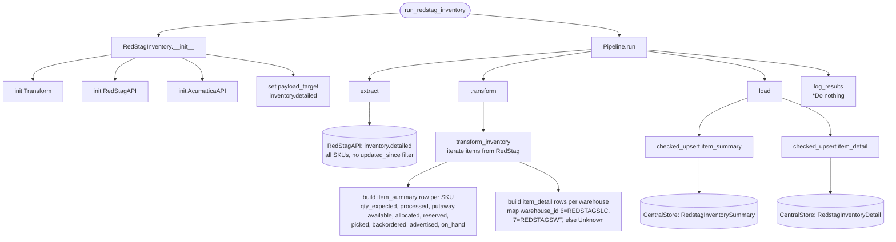

```mermaid
%%{init: {"flowchart": {"wrappingWidth": 400}}}%%
flowchart TD
    A([run_redstag_inventory]) --> B[RedStagInventory.__init__]
    B --> B1[init Transform]
    B --> B2[init RedStagAPI]
    B --> B3[init AcumaticaAPI]
    B --> B4[set payload_target<br/>inventory.detailed]
    A --> RUN[Pipeline.run]

    RUN --> EX[extract]
    EX --> RS1[(RedStagAPI: inventory.detailed<br/>all SKUs, no updated_since filter)]

    RUN --> TR[transform]
    TR --> TR1[transform_inventory<br/>iterate items from RedStag]
    TR1 --> TR2[build item_summary row per SKU<br/>qty_expected, processed, putaway,<br/>available, allocated, reserved,<br/>picked, backordered, advertised, on_hand]
    TR1 --> TR3[build item_detail rows per warehouse<br/>map warehouse_id 6=REDSTAGSLC,<br/>7=REDSTAGSWT, else Unknown]

    RUN --> LD[load]
    LD --> LD1[checked_upsert item_summary]
    LD1 --> CS1[(CentralStore: RedstagInventorySummary)]
    LD --> LD2[checked_upsert item_detail]
    LD2 --> CS2[(CentralStore: RedstagInventoryDetail)]

    RUN --> LR[log_results<br/>*Do nothing]
```
