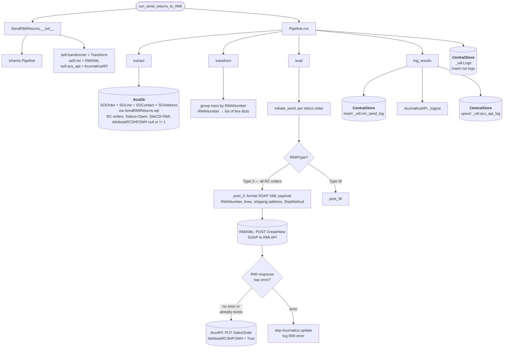

```mermaid
%%{init: {"flowchart": {"wrappingWidth": 400}}}%%
flowchart TD
    A([run_send_returns_to_RMI]) --> B[SendRMIReturns.__init__]
    B --> B1[inherits Pipeline]
    B --> B2[ 
        self.transformer = Transform
        self.rmi = RMIXML
        self.acu_api = AcumaticaAPI
    ]
    A --> RUN[Pipeline.run]

    RUN --> EX[extract]
    EX --> D1[(
        <b><i>AcuDb</i></b>
        SOOrder + SOLine + SOContact + SOAddress<br/>via SendRMIReturns.sql<br/>RC orders, Status=Open, SiteCD=RMI,<br/>AttributeRCSHP2WH null or != 1)]

    RUN --> TR[transform]
    TR --> T1[group rows by RMANumber<br/>RMANumber → list of line dicts]

    RUN --> LD[load]
    LD --> LD1[initiate_send: per return order]
    LD1 --> LD2{RMAType?}
    LD2 -->|Type 3 — all RC orders| LD3[post_3: format SOAP XML payload<br/>RMANumber, lines, shipping address, ShipMethod]
    LD2 -->|Type W| LD4[post_W]
    LD3 --> RS1[(RMIXML: POST CreateNew<br/>SOAP to RMI API)]
    RS1 --> LD5{RMI response<br/>has error?}
    LD5 -->|no error or<br/>already exists| LD6[(AcuAPI: PUT SalesOrder<br/>AttributeRCSHP2WH = True)]
    LD5 -->|error| SKIP[skip Acumatica update<br/>log RMI error]

    RUN --> LR[log_results]
    LR --> LR1[(
        <b><i>CentralStore</i></b>
        insert _util.rmi_send_log
    )]
    LR --> LO[AcumaticaAPI._logout]
    LR --> UPS[(
        <b><i>CentralStore</i></b>
        upsert _util.acu_api_log)]
    RUN --> LOGS[(
        <b><i>CentralStore</i></b>
        _util.Logs<br/>insert run logs
    )]
```
